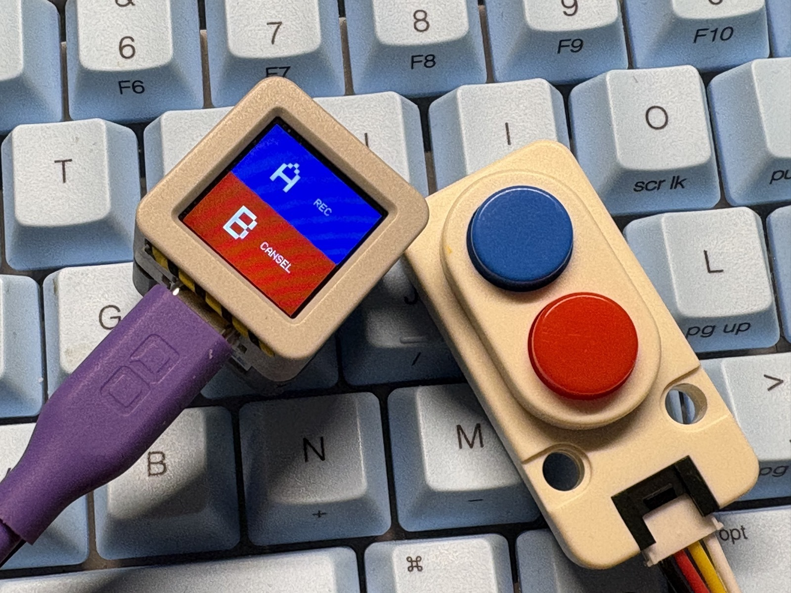
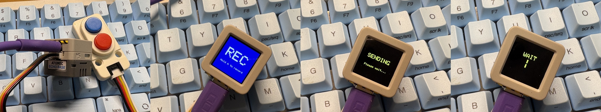

[English (README.md)](./README.md)

# ATOMS3R OpenAI Voice PTT HTTP

AtomS3R + Atomic Voice Base + Dual Button Unit を利用し、
Raspberry Pi 5 経由で OpenAI API と音声対話を行うプロジェクトです。

現在の段階では、

- AtomS3R 側で録音
- Raspberry Pi 5 へ HTTP POST
- OpenAI API による音声認識
- OpenAI API による応答生成
- OpenAI TTS による音声生成
- AtomS3R 側で音声再生



まで動作確認済みです。

---

# 現在の構成

## ハードウェア

- M5Stack AtomS3R
- M5Stack Atomic Voice Base
- M5Stack Dual Button Unit
- Raspberry Pi 5
- モバイルバッテリー

---

# システム構成

```text
AtomS3R
  ↓ Wi-Fi / HTTP POST
Raspberry Pi 5 (FastAPI)
  ↓
OpenAI API
  ├ Speech-to-Text
  ├ LLM
  └ Text-to-Speech
  ↓
Raspberry Pi 5
  ↓ WAV返却
AtomS3R
```

---

# 現在の動作

## AtomS3R 側

### ボタン操作

| 操作 | 内容 |
|---|---|
| Aボタン | 録音 → 送信 → 応答再生 |
| Bボタン | 状態確認（簡易） |

---

## 音声フロー

```text
録音
↓
WAV生成
↓
Pi5へ送信
↓
OpenAI Speech-to-Text
↓
OpenAI LLM
↓
OpenAI TTS
↓
Pi5で WAV 正規化
↓
AtomS3Rで再生
```



---

# 録音フォーマット

現在、正常動作している設定は以下。

```cpp
#define SAMPLE_RATE_HZ       48000
#define BITS_PER_SAMPLE      32
#define CHANNEL_COUNT        1
```

この設定以外では、

- 録音速度異常
- 音程異常
- 無音

などが発生した。

Atomic Voice Base の実際の録音仕様に合わせる必要があった。

---

# Pi5 側 TTS 正規化

Pi5 側では ffmpeg を使用し、
OpenAI TTS の返答 WAV を AtomS3R 再生向けに変換している。

例:

```python
cmd = [
    "ffmpeg",
    "-y",
    "-i", str(raw_tts_path),
    "-ar", "48000",
    "-ac", "1",
    "-c:a", "pcm_s32le",
    "-filter:a", "volume=4.0",
    str(normalized_path),
]
```

---

# 現在の音量設定

## Pi5 側

```python
"-filter:a", "volume=4.0"
```

## AtomS3R 側

```cpp
#define SPEAKER_VOLUME_PERCENT 65
```

---

# 必要ライブラリ

Arduino IDE:

- M5Unified
- M5GFX
- M5Atomic-EchoBase

Python:

```text
fastapi
uvicorn[standard]
python-dotenv
openai
python-multipart
```

---

# Git 運用

現在の安定地点:

```text
v0.1.0
```

Gitタグを付与済み。

作業ブランチ:

```text
work-from-v0.1.0
```

---

# 現在確認済みのこと

- PSRAM 8MB 利用可能
- HTTP multipart upload 成功
- OpenAI Speech-to-Text 成功
- OpenAI TTS 成功
- WAV返却成功
- AtomS3R側で音声再生成功

---

# 今後の予定

- 状態表示改善
- 押下中録音
- 音量調整
- 長押し操作
- 会話継続
- ストリーミング化
- 会話履歴
- OpenAI Realtime API 化

---

# 注意事項

ESP32 音声系は、

- I2S
- WAV
- Sample Rate
- Bit Depth
- PSRAM
- HTTP
- OpenAI API

などが複雑に絡む。

一気に機能追加すると壊れやすいため、
Gitタグによる小刻み管理を強く推奨。

---

# License

MIT License

Copyright (c) 2026 omiya-bonsai

---

# AI 利用について

このリポジトリ、そのドキュメント、および関連アセットの一部は、Codex app や GitHub Copilot などの AI ツールの支援を受けて作成・更新しています。
